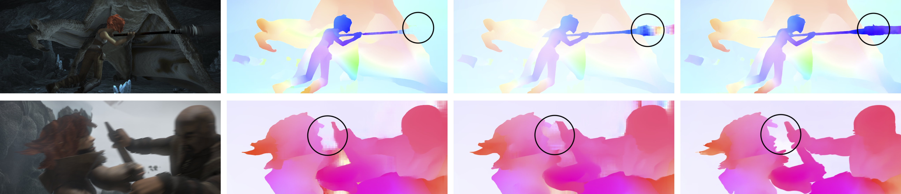

# FFlow


Official PyTorch implementation of RoCo-Spring Challenge Paper FFlow:

[**Foundation Model Driven Optical Flow**]

Authors: [Praroop Chanda](https://praroopchanda.github.io/), [Suryansh Kumar](https://suryanshkumar.github.io/)


<p align="center"></p>


### Results


  <p align="center"></p>

  


## Installation

Our code is based on pytorch 2.0.1, CUDA 11.8 and python 3.11. Higher version pytorch should also work well.

We recommend using [conda](https://www.anaconda.com/distribution/) for installation:

```
conda env create -f environment.yml
conda activate flow_env
```

## DINOv2 and DepthAnythingV2 Foundation Models

Please download **DINOv2-S** and **DepthAnythingV2-B** before using our TTS model

- For **DINOv2**, we directly use the Hugging Face Transformers version. You can also download the model locally and update the model path for offline usage.
- For **DepthAnythingV2**, please download the **Base** checkpoint from the official [DepthAnythingV2 repository](https://github.com/DepthAnything/Depth-Anything-V2).

**Note:** Both foundation models remain frozen during training and inference.

## Demos


You can run a trained model on a sequence of images and visualize the results:

```
CUDA_VISIBLE_DEVICES=0 python3 main.py \
--inference_dir demo/sintel_market_1 \
--output_path output/FFlow_flow_market_place_output \
--resume TTS_ckpts/FFlow_CT_TSKH.pth
--padding_factor 32 \
--upsample_factor 4 \
--num_scales 2 \
--attn_splits_list 2 8 \
--corr_radius_list -1 4 \
--prop_radius_list -1 1 \
--dino_path facebook/dinov2-small \
--depth_model_path depth_anything_v2_ckpt.pth
```


## Datasets

The datasets used to train and evaluate FFlow are as follows:

* [FlyingChairs](https://lmb.informatik.uni-freiburg.de/resources/datasets/FlyingChairs.en.html#flyingchairs)
* [FlyingThings3D](https://lmb.informatik.uni-freiburg.de/resources/datasets/SceneFlowDatasets.en.html)
* [Sintel](http://sintel.is.tue.mpg.de/)
* [KITTI](http://www.cvlibs.net/datasets/kitti/eval_scene_flow.php?benchmark=flow)
* [HD1K](http://hci-benchmark.iwr.uni-heidelberg.de/) 
* [Spring](https://spring-benchmark.org/)

By default the dataloader [datasets.py](data/datasets.py) assumes the datasets are located in folder `datasets` and are organized as follows:

```
datasets
├── FlyingChairs_release
│   └── data
├── FlyingThings3D
│   ├── frames_cleanpass
│   ├── frames_finalpass
│   └── optical_flow
├── HD1K
│   ├── hd1k_challenge
│   ├── hd1k_flow_gt
│   ├── hd1k_flow_uncertainty
│   └── hd1k_input
├── KITTI
│   ├── testing
│   └── training
├── Sintel
│   ├── test
│   └── training
├── Spring
│   ├── train
│   └── test
```


Please change the corresponding paths in [datasets.py](data/datasets.py).


## Evaluation

You can evaluate a trained FFlow model by running:

```
CUDA_VISIBLE_DEVICES=0 python3 main.py --eval --val_dataset sintel --resume FFlow_ckpts/FFlow_CT_TSKH.pth --dino_path facebook/dinov2-small --depth_model_path depth_anything_v2_ckpt.pth --padding_factor 32 --upsample_factor 4 --num_scales 2 --attn_splits_list 2 8  --corr_radius_list -1 4 --prop_radius_list -1 1 --with_speed_metric
```


## Training

All training scripts on FlyingChairs, FlyingThings3D, Sintel, KITTI and Spring datasets can be found in [run_all.py](run_all.py).

FFlow model can be trained on 2x 48GB RTX 6000 GPUs. Please adjust the batch size according to your hardware. 


You can also use tensorboard to monitor and visualize the training process. You can first start a tensorboard session with

```shell
tensorboard --logdir checkpoints
```

and then access [http://localhost:6006](http://localhost:6006) in your browser.


## Acknowledgements

This work could not have been possible without these remarkable repos : [RAFT](https://github.com/princeton-vl/RAFT), [GMFlow](https://github.com/haofeixu/gmflow), [DETR](https://github.com/facebookresearch/detr), [Swin](https://github.com/microsoft/Swin-Transformer), [DinoV2](https://github.com/facebookresearch/dinov2), [DepthAnythingV2](https://github.com/DepthAnything/Depth-Anything-V2) and [FoundationalStereo](https://nvlabs.github.io/FoundationStereo/). We thank the original authors for their excellent work.